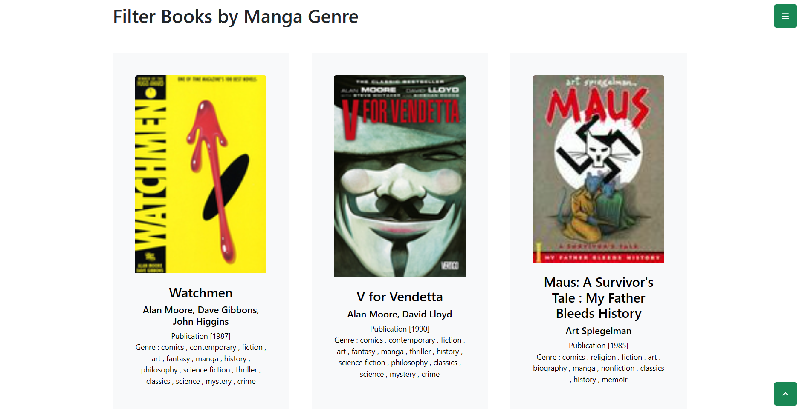

# Book Recommendation System with Goodbooks-10k Data

Goodreads is a social platform for readers where they can rate, review, and share the books they read. Goodreads was founded with a mission to get people more excited about reading and the key to getting people excited about reading is to help them find books they like, as well as allowing them to share their thoughts and experiences with friends. On Goodreads, users can follow other users and gather in communities, seeing books that other people have rated and read. According to an article on harvard.edu, Goodreads has millions of book collections and hundreds of millions of users. User preferences for books are very diverse, starting from language, genre, writing style, and many other factors. Therefore, users often experience difficulty in choosing books to read and assess. This user difficulty resulted in a decrease in activity on the Goodreads site. If this is allowed to happen, the number of new ratings and reviews given will decrease so that the Goodreads site will no longer be relevant to the actual development of existing books.

A feature will be created that keeps reader activity or user journey running continuously, namely by predicting what books the reader likes from the rating data. The results of this prediction are suggested to readers so that readers are interested in reading because it suits their preferences and carries out ratings and/or reviews for the recommended books.

Data obtained from the Goodbooks dataset. On this site, there are several datasets with the comma-separated value type. Those used in this analysis are:
- `books.csv`: book metadata
- `ratings.csv`: the rating given by the user 
- `book_tags.csv`: virtual library that users associate
- `tags.csv`: list of user-created virtual library names

Book rating and metadata data will be used in modeling, while book tag data will be used to extract genre information on books. In this analysis, 25% of the data was used, namely 2500 books and 13,356. After filtering 25% of the data, 1,122,956 ratings were obtained. For training and testing data, the proportions are 80% and 20% respectively.

The following is the user journey readers expected to face while using Goodreads after the recommendation feature was implemented:

There are two methods used to give book recommendations to readers, the first one is the non-personalized method which is Top K popular Books and Filtering by Genre. The number of ratings given by users to each book is calculated and then sorted to get the most popular books. As additional information, virtual library names are extracted to obtain book genres. The other method is a Personalized one using user-item interaction data (collaborative filtering). For Personalized recommendation, 5-fold cross-validation is carried out on 5 types of algorithms to get the model with the best performance:

KNN Baseline has the smallest RMSE value with hyperparameters `k = 25` (refers to the number of nearest neighbors considered by the model, the number of neighbors influences the model in understanding user preferences), `pearson_baseline` (calculation of similarity between items and users) and `min_k = 2` ( minimum nearest neighbor value required to make a prediction. This difference could be a signal that the K-Nearest Neighbors (KNN) model has the potential to be overfitting. Overfitting occurs when a model overfits the training data so that its performance suffers. The difference between the RMSE value when doing cross-validation on the training data (0.856) and the RMSE on the test data (0.858) looks small.

The advantage of KNN is seen in its ability to capture relationships between users who have similar behavior. KNN can also overcome the limitations of the baseline model by more adaptively responding to patterns in the data. Although KNN has the risk of overfitting the training data, the use of overfitting control techniques such as selecting an appropriate number of neighbors can help reduce its impact. Having a low RMSE value in a recommendation system model can have a positive impact on user retention. This is because a low RMSE value indicates that the model has a better ability to predict user preferences and provide recommendations that match their preferences. Users tend to be more satisfied with accurate and relevant recommendations, which can ultimately encourage them to stay on the platform.

From this, solutions that may need to be implemented are:
1. If possible use more training data, by having more variation in the data the model can be understood better.
2. Carrying out regularization can help control model complexity and avoid overfitting.

The book recommendations are implemented through these interfaces:

||

 

  

